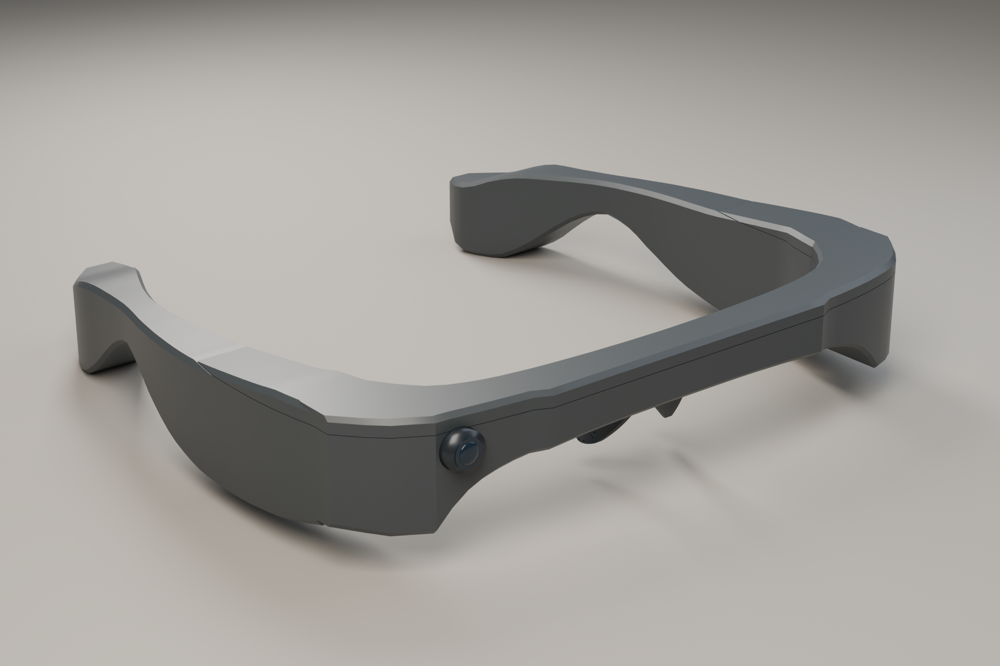

<div align="center">

# AI Glasses for Navigation
### Lower-cost hardware. Shared know-how. Community-oriented design.

[中文介绍](docs/README.zh-CN.md) · [3D files](design/v0.4/README.md) · [Render gallery](docs/GALLERY.md) · [Run the demo](#run-the-demo)


**CONTINUOUS FACETS / DESIGN v0.4**<br>
A new lensless wraparound enclosure with a straighter brow, clipped corners and integrated temple surfaces.

*Digital prototype rendered from the included Blender model. Not a photograph of a manufactured product.*

</div>

## Community first


*In-person session photograph provided by the project creator.*

| **4 communities** | **Nearly 100 people** | **3 communities** |
|:---:|:---:|:---:|
| Engaged through outreach | Blind or visually impaired people reached | Received practical making instruction |

The project creator reports reaching nearly 100 blind or visually impaired people across four communities. In three communities, the creator provided explanations of how to make the device, aiming to let local participants continue without ongoing funding or material donations from the creator.

The focus is both **affordable hardware and knowledge that communities can retain**. These are creator-reported outreach figures, not device-delivery counts or measured mobility outcomes. [Read the community story and reporting scope →](docs/COMMUNITY_AND_COST.md)

## Affordability by design

**Under US$20 in China · Estimated under US$30 in the US — hardware only.**

The earlier prototype cost under US$20 in hardware when the creator built it in China. The creator currently estimates under US$30 for a US build. Phone/computer, cloud services, tools, labor and other non-hardware costs are excluded. The new v0.4 enclosure has not yet been separately fabricated or costed. [Cost context →](docs/COMMUNITY_AND_COST.md#hardware-cost)

## A new, continuous exterior

<table>
<tr><td></td><td></td></tr>
<tr><td align="center">Front / integrated brow</td><td align="center">Side / broad continuous surfaces</td></tr>
<tr><td></td><td></td></tr>
<tr><td align="center">Top / wraparound layout</td><td align="center">Rear / interior access</td></tr>
</table>

The silhouette comes from the housing itself: broad faces meet through clipped corners rather than added decorative frames. The new body and upper cover are editable parts. The original assembly is retained in a separate reference collection for inspection.

**Engineering status:** the model preserves the original coordinate scale and uses a conservative keep-out envelope. Actual battery, PCB and cable dimensions, physical units, fastening and assembly tolerances still need verification. It is a design prototype, not a print-ready or fit-certified release. [Model files and checks →](design/v0.4/README.md)

## In context


*Both scenes are synthetic Blender renders of the same v0.4 model. They illustrate intended contexts, not actual outreach sessions or evidence of device use.*

[Explore all 11 angles and scenes →](docs/GALLERY.md)

## Project documentation

- **[Project overview](docs/PROJECT_OVERVIEW.md):** software architecture, enclosure design, community work and current integration status.
- **[Presentation renders](design/v0.4/presentation/README.md):** two Blender renders, an editable workbench scene, a render script and a product-mesh consistency record.



*Native Blender CGI. The generic precision-tool prop was informed by real product references; it is not a supplied accessory or evidence of a brand partnership.*

## What the project includes

- **Wearable design:** the new v0.4 mesh assembly, editable Blender scene, shell exports and reproducible render setup.
- **Runnable software:** a hardware-free FastAPI demo that turns structured observations into conservative traffic-light, obstacle and crosswalk messages.
- **Development tools:** a browser dashboard, JSONL replay, process-local event history and an optional authenticated device-observation gateway.
- **Community documentation:** outreach, making instruction and an explicitly scoped hardware-cost account.

Live camera perception, speech and complete wearable integration remain separate development work. Earlier YOLO/ESP32/voice explorations are not presented as fully integrated features of this release. [Full project overview →](docs/PROJECT_OVERVIEW.md)

## Run the demo

```bash
git clone https://github.com/DresdenGman/AIGlasses_for_navigation.git
cd AIGlasses_for_navigation
python -m venv .venv
source .venv/bin/activate  # Windows: .venv\Scripts\activate
python -m pip install -r requirements.txt
cp .env.example .env
python main.py
```

Open [the local dashboard](http://127.0.0.1:8081/) or [interactive API docs](http://127.0.0.1:8081/docs). Demo mode needs no camera, ESP32, model weights or cloud keys.

```bash
python -m aiglasses.replay demo/events.jsonl
python -m pip install -e '.[dev]'
python -m pytest
```

## Explore the repository

| Area | Start here |
|---|---|
| Latest 3D design | [v0.4 assembly and usage](design/v0.4/README.md) |
| Product images | [Gallery and image provenance](docs/GALLERY.md) |
| Community and affordability | [Reported reach, instruction and cost](docs/COMMUNITY_AND_COST.md) |
| Software | [Architecture](docs/ARCHITECTURE.md) · [Demo](docs/DEMO.md) · [Device gateway](docs/HARDWARE_GATEWAY.md) |
| Project direction | [Overview](docs/PROJECT_OVERVIEW.md) · [Roadmap](docs/ROADMAP.md) |

## Attribution & responsible use

Earlier project documentation credited [AI-FanGe / OpenAIglasses_for_Navigation](https://github.com/AI-FanGe/OpenAIglasses_for_Navigation); that upstream attribution is retained. See the [project overview](docs/PROJECT_OVERVIEW.md#attribution-and-provenance) and [MIT license](LICENSE).

This is an assistive-technology **research prototype**, not a certified navigation aid. It must not replace a white cane, guide dog, personal judgment or traffic rules. Renders are design visualizations; community figures are creator-reported. Keep credentials, recordings and participant data out of Git.
