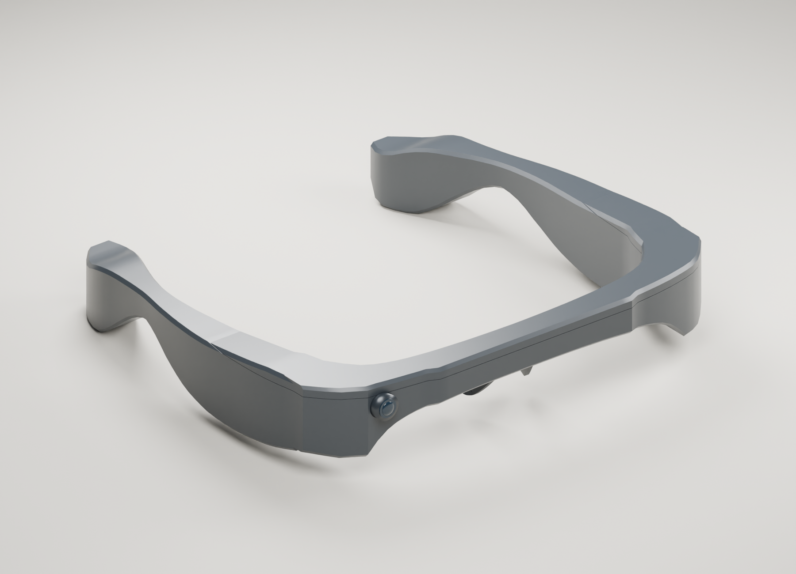
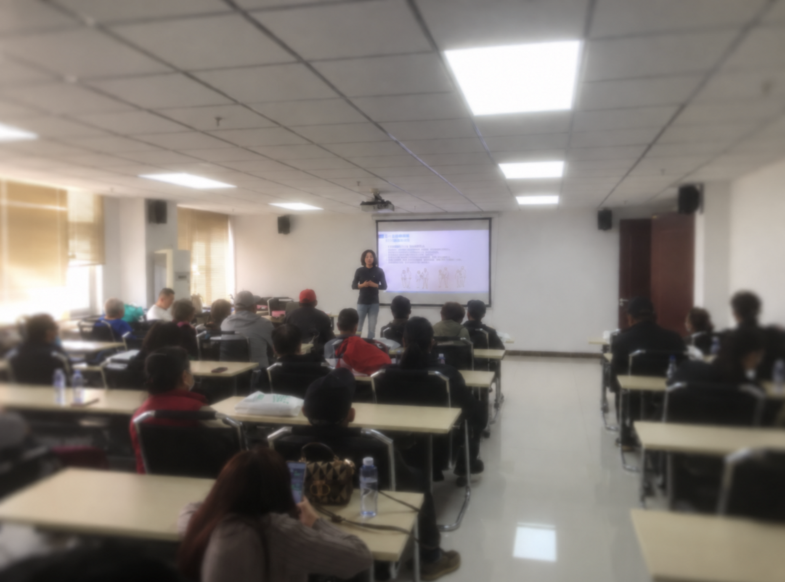
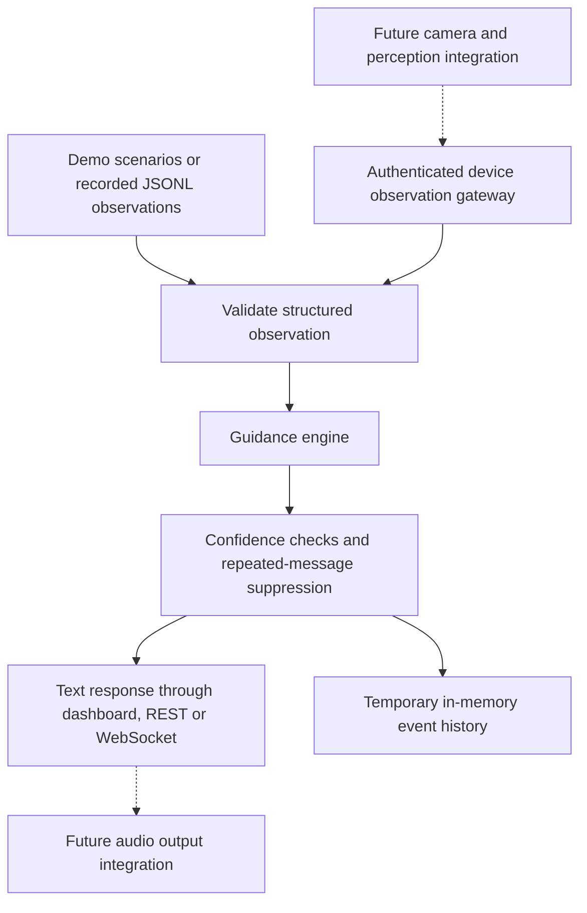
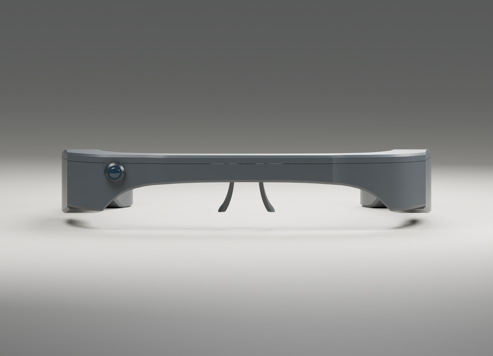
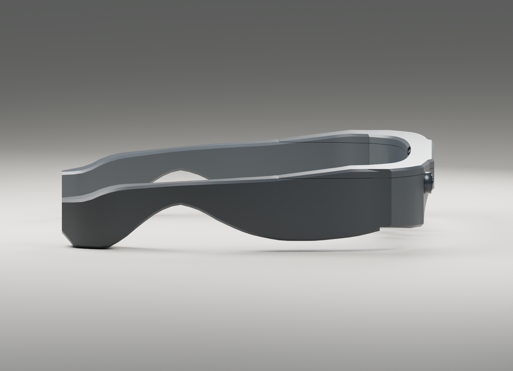
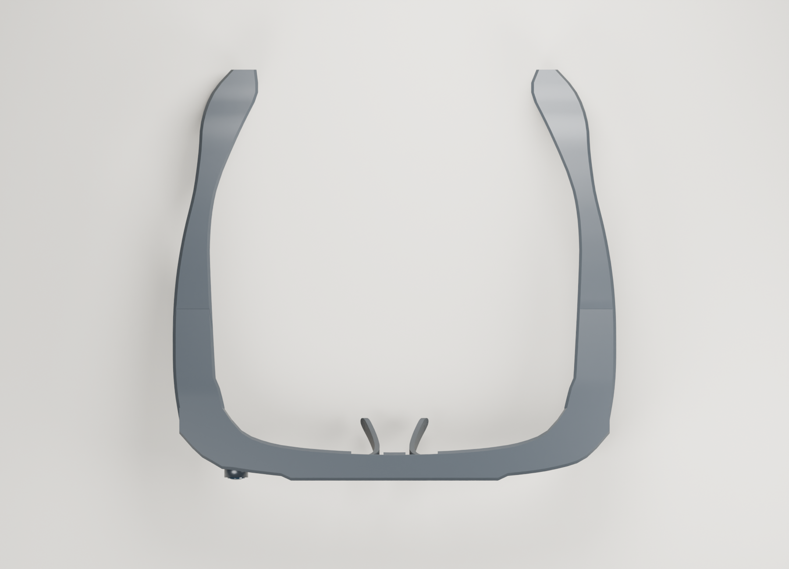
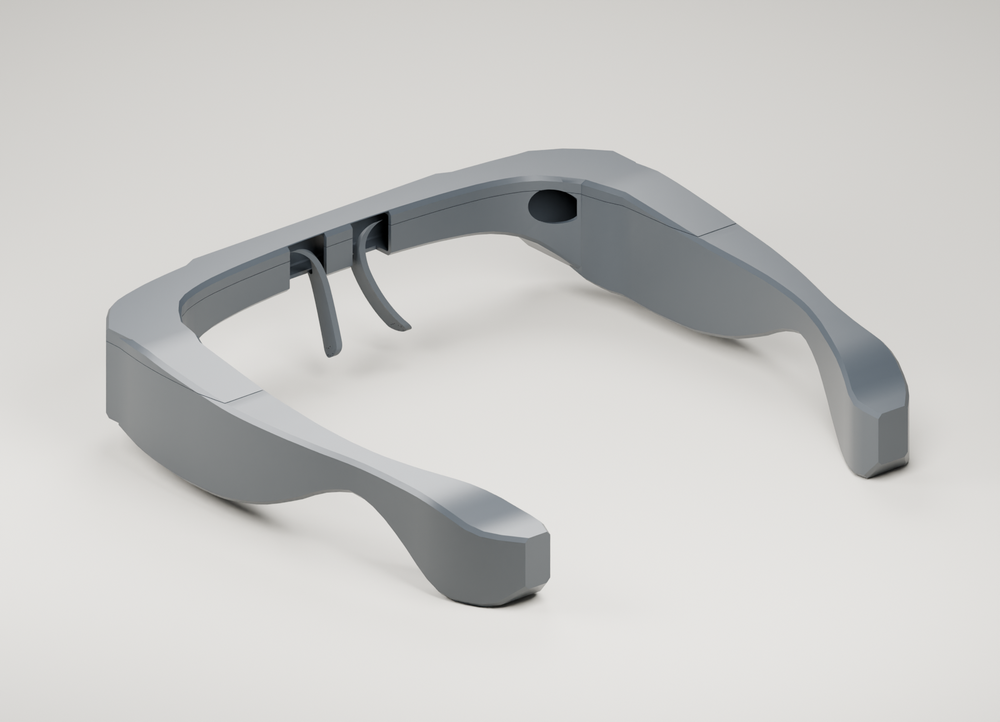
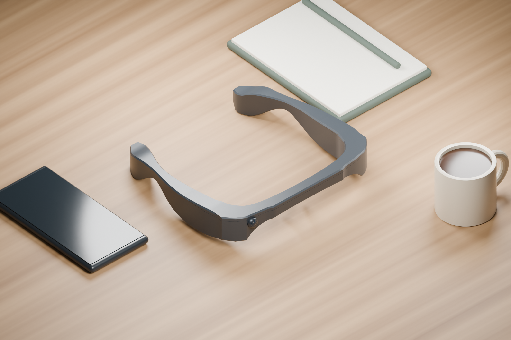
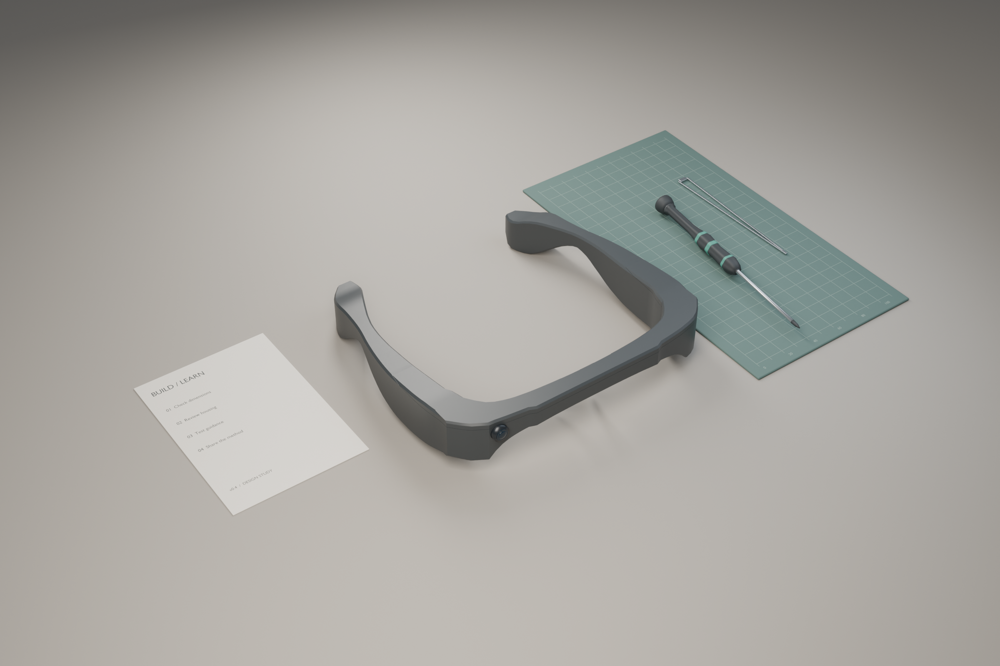

<div align="center">

# AI Glasses for Navigation
### Lower-cost visual assistance. Shared making knowledge. Community participation.

[Project](#the-project) · [Timeline](#project-timeline) · [Community](#community-first) · [How it works](#how-the-system-works) · [Design](#wearable-design--continuous-facets-v04) · [Run the demo](#run-the-demo) · [中文介绍](docs/README.zh-CN.md)



**CONTINUOUS FACETS / DESIGN v0.4**<br>
An editable, lensless wraparound enclosure with a straighter brow, clipped corners and integrated temple surfaces.

*Blender render of the digital enclosure prototype; not a photograph of a manufactured product.*

</div>

## The project

AI Glasses for Navigation explores affordable, wearable visual assistance for blind and visually impaired people. It brings together three parts: a hardware and enclosure project, software that translates observations into guidance, and community outreach that shares how the device can be made.

Development began in **early 2025**. The initial building and development phase spanned **nearly a year**, before the project was uploaded to GitHub in **December 2025**. Community work began in **late 2025** and has continued alongside technical iteration. The project therefore predates this repository: GitHub records the published work, while the earlier building process and community activities form part of the broader project history.

The aim is to make visual-assistance hardware more affordable and its construction more understandable. Sharing the making process matters alongside the device itself: participants can learn how it works and build local knowledge that can continue beyond a single visit or donation.

Today, this repository contains a runnable guidance demo, an editable v0.4 enclosure and its render gallery, plus documentation of community work and hardware costs. Live camera perception, speech output and a fully integrated wearable remain separate development work in the current release.

## Project timeline

| Period | Milestone | What changed |
|---|---|---|
| **Early 2025** | Building began | Initial development of the AI glasses project started, before publication on GitHub. |
| **Throughout 2025** | Nearly a year of initial development | Building and development continued across the year, forming the early prototype and project direction. |
| **Late 2025** | Community work began | The project moved into community outreach and practical explanation, beginning an ongoing effort to broaden participation and share making knowledge. |
| **December 2025** | First GitHub publication | The [initial repository commit](https://github.com/DresdenGman/AIGlasses_for_navigation/commit/12b121a3) was recorded on December 9, 2025 (UTC). Early documentation described tactile-paving navigation, crosswalk assistance, object search and voice interaction. |
| **July 29, 2026** | Reproducible software prototype | A hardware-free FastAPI core, interactive dashboard, JSONL replay and in-memory event history were added. An authenticated device-observation gateway, per-device rate limiting, packaging and CI test configuration followed in the same iteration. |
| **September 18, 2026** | Continuous Facets v0.4 | The lightweight enclosure direction was published with editable Blender files, GLB/STL exports, geometry checks, multiple rendered views and clearer community and cost documentation. |
| **Late 2025–present** | Continuing community engagement | Outreach has reached four communities and nearly 60 blind or visually impaired people; three communities received practical explanations of how to make the device. Technical development and community engagement continue in parallel. |

The early development dates and community history are provided by the project creator. Publication and software milestones are documented in the [commit history](https://github.com/DresdenGman/AIGlasses_for_navigation/commits/main/). The nearly one-year period refers to initial development during 2025; subsequent iteration continues beyond that period.

## Community first



| **4 communities** | **Nearly 60 people** | **3 communities** |
|:---:|:---:|:---:|
| Engaged through outreach | Blind or visually impaired people reached | Received practical making instruction |

Beginning in late 2025, the project expanded from building the device to sharing it through community engagement. The project creator reports reaching nearly 60 blind or visually impaired people across four communities and providing explanations of how to make the device in three communities.

The emphasis is on **affordable hardware and knowledge that communities can retain**. Making instruction is intended to help local participants continue without relying on the creator for ongoing funding or material donations. Community engagement remains an ongoing part of the project as its reach develops.

These figures describe contact and instruction, rather than devices delivered or daily active users. Independent production volume, long-term use and improvements in mobility have not been quantified. The community work concerns the broader project and earlier prototype; it does not establish deployment of the new v0.4 enclosure.

[More on community work and reporting scope →](docs/COMMUNITY_AND_COST.md)

## What the glasses are intended to help with

The broader project explores four everyday assistance workflows. These informed the earlier prototype documentation and remain the context for the current work.

| Workflow | Intended assistance | Current repository scope |
|---|---|---|
| **Tactile-paving navigation** | Recognize a path, describe alignment and identify nearby obstacles. | Earlier materials describe YOLO segmentation and path-guidance experiments. The current demo handles obstacle observations; it does not implement a complete tactile-path navigation pipeline. |
| **Crosswalk and traffic-light awareness** | Identify a crosswalk and communicate traffic-light observations with uncertainty. | The guidance engine handles structured crosswalk and red/green/unknown light inputs. Live recognition accuracy and safe crossing have not been established by this demo. |
| **Object search** | Find a named object and provide cues about its location. | Earlier materials describe YOLO-E detection, tracking and MediaPipe hand cues. These are not integrated into the current demo. |
| **Voice interaction** | Ask questions and receive spoken assistance without relying on a visual display. | Earlier materials reference speech recognition and multimodal services. The current core returns text guidance; end-to-end audio integration remains outstanding. |

## How the system works

The intended wearable pipeline starts with a camera, turns visual input into observations, applies guidance rules and communicates the result through audio. The current runnable software implements the **observation-to-guidance** portion, making its behavior inspectable without camera hardware or cloud access.



### Guidance behavior

Observations include a category and confidence value, plus fields such as traffic-light state, obstacle distance or object label. The engine then applies deterministic rules:

- **Traffic lights:** a red-light observation produces a stop-and-wait message. A green-light observation includes a reminder to check surrounding vehicles. An unknown state produces an uncertainty message.
- **Obstacles:** an observation at 1.5 meters or less produces a nearby-obstacle warning; other obstacle observations produce a general caution.
- **Crosswalks:** a crosswalk observation produces a message about orientation and checking the signal.
- **Low confidence:** observations below the default 0.70 confidence threshold produce an uncertainty message marked as non-actionable.
- **Repeated messages:** the same guidance category is suppressed within the default three-second cooldown.

These rules respond to supplied observations; they do not prove that a camera detected the scene correctly. Current guidance messages and the demo interface are in Chinese. The project documentation is primarily in English.

### Software and hardware responsibilities

| Component | Role and status |
|---|---|
| **FastAPI service** | Validates observations and exposes the demo dashboard, REST endpoints and WebSocket interface. |
| **Guidance engine** | Converts traffic-light, obstacle and crosswalk observations into text guidance, with confidence and repetition handling. |
| **Replay tool** | Runs recorded JSONL observations through the same guidance rules for reproducible inspection. |
| **Device gateway** | Accepts observations with a matching token in hardware mode; defaults to 120 requests per minute per device. Intended for controlled development networks. |
| **Camera and perception** | Earlier work references ESP32 capture, YOLO/YOLO-E and MediaPipe. Live perception adapters remain integration work for the current core. |
| **Audio and interaction** | Earlier work references microphones, speakers and cloud speech/multimodal services. These are separate from the current text-response demo. |
| **Power and enclosure** | The design provides an enclosure study. Measured electronic-part dimensions, power requirements, fastening and physical assembly still require verification. |

Setting hardware mode enables the observation endpoint; it does not automatically connect an ESP32, run a vision model or produce speech. [Architecture](docs/ARCHITECTURE.md) · [Device gateway](docs/HARDWARE_GATEWAY.md) · [Project overview](docs/PROJECT_OVERVIEW.md)

### Data handling

The demo stores the latest **100 guidance events** in process memory: timestamp, observation category, confidence, severity, actionability and message text. Restarting the service clears that history. This event store does not retain raw frames, audio, location or device IDs; device IDs are used separately for in-memory rate limiting. Future camera, recording or cloud integrations have separate data-handling requirements. [Data boundaries →](docs/DATA_BOUNDARIES.md)

## Wearable design — Continuous Facets v0.4

The current enclosure is a lensless wraparound design with a straighter brow, clipped corners and tightened temples. Its continuous surfaces come from the housing itself. Six original exterior skin patches were replaced, while the original assembly remains available in a separate reference collection.

<table>
<tr><td></td><td></td></tr>
<tr><td align="center">Front / integrated brow</td><td align="center">Side / continuous surfaces</td></tr>
<tr><td></td><td></td></tr>
<tr><td align="center">Top / wraparound layout</td><td align="center">Rear / interior access</td></tr>
</table>

The lower body and upper cover are editable parts. The package includes a Blender assembly, a preserved source reference, GLB preview, shell STL exports, construction scripts and reproducible render scenes. The initial concept board was AI-generated; the published product views are rendered from the editable Blender geometry.

Geometry checks cover shell topology, surface intersections and containment against the protected source geometry. They do not establish calibrated physical units, actual battery/PCB/cable fit, thermal performance, fastening or assembly tolerances. The v0.4 enclosure is a digital design prototype; its STL exports are not production-validated printing files.

[Open the model and inspect the checks →](design/v0.4/README.md)

### Design in context





*These are synthetic Blender scenes of the same v0.4 model, rather than records of device use or community activities. The tools are generic props, not supplied accessories or a brand partnership.*

[All 11 views and image provenance](docs/GALLERY.md) · [Editable presentation scenes](design/v0.4/presentation/README.md)

## Affordability by design

Reducing hardware cost is central to the project, alongside sharing the knowledge needed to make it.

| Build context | Hardware-only cost | Basis |
|---|---|---|
| **Earlier prototype built in China** | **Under US$20 per unit** | The creator's reported cost for the earlier build. |
| **Estimated US build** | **Under US$30 per unit** | The creator's estimate; not yet verified against a supplier quotation. |
| **New v0.4 enclosure** | **Not separately costed** | Digital design awaiting fabrication and assembly validation. |

These amounts exclude a phone or computer, cloud services, tools, labor and other non-hardware expenses. The earlier prototype's cost is not a verified cost for manufacturing v0.4. A fully itemized bill of materials, including sourcing, shipping, taxes and enclosure fabrication, is not yet available. [Cost details →](docs/COMMUNITY_AND_COST.md#hardware-cost)

## Current status and continuing work

The repository provides a working software demonstration and inspectable design assets. It does not yet establish a fully integrated, field-validated navigation device.

| Area | Available now | Continuing work |
|---|---|---|
| **Software** | Guidance rules, dashboard, REST/WebSocket interfaces, replay and device ingestion. | Live camera/perception adapters and audio output. |
| **Enclosure** | Editable v0.4 geometry, exports, render scenes and source-geometry checks. | Physical scale calibration, measured components, mounting, cable routing, fabrication and fit. |
| **Evaluation** | Repeatable structured-observation scenarios and repository tests. | Video-based perception evaluation, latency and error measurements, message comprehension and physical-prototype testing. |
| **Community** | Outreach across four communities and making instruction in three, reaching nearly 60 people. | Continued engagement and documentation of longer-term participation, independent making and use. |

[Development roadmap →](docs/ROADMAP.md)

## Run the demo

Use Python 3.11 or later for the current source. Demo mode requires no camera, ESP32, model weights or cloud keys.

```bash
git clone https://github.com/DresdenGman/AIGlasses_for_navigation.git
cd AIGlasses_for_navigation
python -m venv .venv
source .venv/bin/activate  # Windows: .venv\Scripts\activate
python -m pip install -r requirements.txt
cp .env.example .env
python main.py
```

Open the [local dashboard](http://127.0.0.1:8081/) or [interactive API docs](http://127.0.0.1:8081/docs). The dashboard sends sample observations through the guidance engine.

Replay the included observations or run the software tests:

```bash
python -m aiglasses.replay demo/events.jsonl
python -m pip install -e '.[dev]'
python -m pytest
```

The current entry point is `main.py`, with implementation under `aiglasses/`. Earlier prototype instructions referring to other entry points describe a different stage of the project. [Demo guide →](docs/DEMO.md)

## Explore the repository

| Area | Files and documentation |
|---|---|
| Project scope | [Overview](docs/PROJECT_OVERVIEW.md) · [Roadmap](docs/ROADMAP.md) |
| Software | [Architecture](docs/ARCHITECTURE.md) · [Demo](docs/DEMO.md) · [Device gateway](docs/HARDWARE_GATEWAY.md) · [Data boundaries](docs/DATA_BOUNDARIES.md) |
| Design | [v0.4 model and downloads](design/v0.4/README.md) · [Geometry provenance](design/v0.4/PROVENANCE.md) · [Release notes](docs/RELEASE_v0.4.md) |
| Images | [Render gallery](docs/GALLERY.md) · [Editable presentation scenes](design/v0.4/presentation/README.md) |
| Community and cost | [Reach, instruction and hardware costs](docs/COMMUNITY_AND_COST.md) |
| Contributions | [Contributor guide](docs/CONTRIBUTING.md) · [Issues](https://github.com/DresdenGman/AIGlasses_for_navigation/issues) |
| 中文 | [中文项目介绍](docs/README.zh-CN.md) |

## Attribution & responsible use

Earlier project documentation credited [AI-FanGe / OpenAIglasses_for_Navigation](https://github.com/AI-FanGe/OpenAIglasses_for_Navigation) as an upstream code project. Historical vision and voice work includes upstream contributions; attribution and existing license notices are retained. See the [MIT license](LICENSE).

This is an assistive-technology **research prototype**, not a certified navigation aid. It must not replace a white cane, guide dog, professional mobility support, personal judgment or traffic rules. Outreach figures describe community engagement; the current release makes no measured mobility-performance or field-safety claim.
