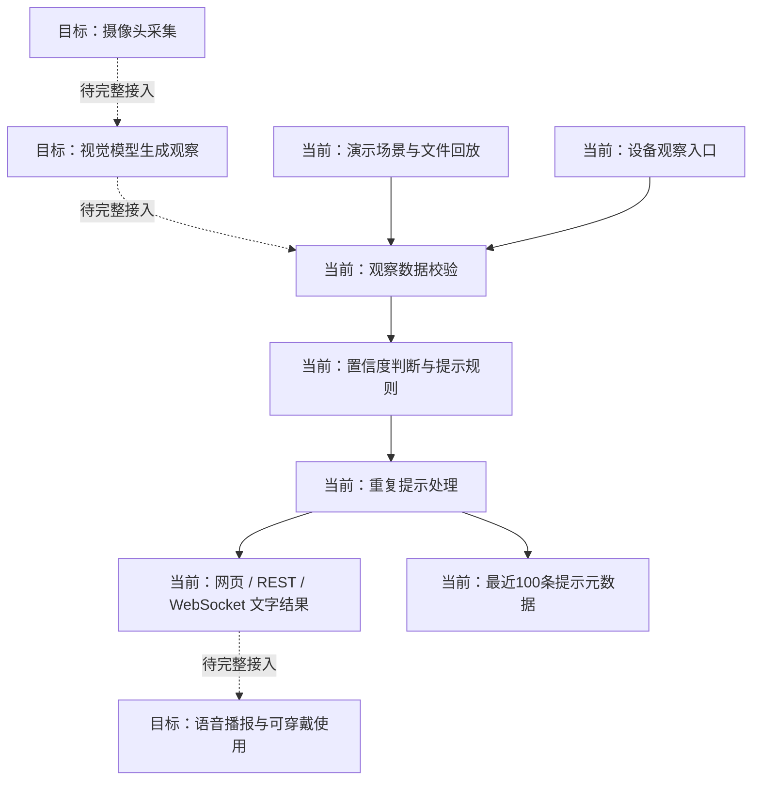

# AI Glasses：项目完整说明与展示方案

更新：2026-09-18。本文依据当前 main 分支的代码、v0.4 模型与检查记录，以及创作者在本次对话中提供的社区和成本经历编写。历史实物、当前软件演示和新版数字外壳处在不同完成阶段。

## 1. 项目究竟在做什么

AI Glasses for Navigation 是一个围绕低成本视觉辅助、可穿戴外壳和社区制作知识展开的项目。目标是探索如何把周围环境中的视觉信息转化成更容易理解的提示，并降低硬件和学习门槛，让更多人有机会了解和参与制作。

项目包含三个相互联系的部分：硬件与外观实验、可复现的软件提示原型、社区接触与制作讲解。仅展示一张眼镜效果图无法解释完整项目；完整介绍需要让观众看懂“为什么做、怎样工作、已经做了什么、如何让别人继续做”。

建议主页核心表达：**让视觉辅助更易负担，让制作方法能够在社区延续。** 英文可使用：“Lower-cost visual assistance. Knowledge communities can build on.” 这是设计与传播方向，不表示已实现适用于所有人的完整导航产品。

## 2. 面向的需求与使用情境

项目关注盲人及低视力人士获取环境信息时的困难。不同人的剩余视力、听觉条件、出行技能、舒适度和设备习惯不同，因此后续体验不应只问“识别准不准”，还应考虑提示是否打断交流、是否容易听懂、是否过多、是否会造成误解，以及是否方便维护。

历史项目材料提出过四类工作流：盲道相关引导、斑马线与交通信号识别、按名称寻找物体、语音提问或交互。这些是更完整的硬件系统方向。当前公开仓库可运行的核心，是接收结构化观察并生成文字提示的演示服务；它没有因此自动具备完整摄像头视觉、语音播放与佩戴设备联动能力。

传播中可以用情境示意解释这些需求，但画面应标明“目标工作流”或“场景示意”。不能把绿灯识别画成保证可以安全通行的指令，也不应让观众误以为眼镜替代了盲杖、导盲犬或其他出行支持。

## 3. 当前软件是怎样工作的

当前可复现流程为：演示场景／回放文件／设备观察输入 → 数据校验 → 提示规则 → 置信度与重复提示处理 → 网页、REST API 或 WebSocket 输出。

视觉模型未来需要把摄像头内容转为统一的观察对象。当前对象包括 `kind`（类别）、`confidence`（置信度）、可选 `distance_m`（距离）、`light_state`（信号灯状态）与 `label`（标签）。提示规则本身不负责从图像估计这些值。接口里出现距离字段，不代表仓库已经实现可靠测距。

| 输入情形 | 当前代码行为 | 对展示的意义 |
|---|---|---|
| 置信度低于默认 0.70 | 输出“前方情况不确定，请谨慎确认。” | 展示系统对不确定性的处理，0.70 是规则阈值，不是准确率 |
| 红灯且置信度足够 | 输出“红灯，请停下等待。” | 可用真实演示输入展示规则输出 |
| 绿灯且置信度足够 | 输出“检测到绿灯，请先确认周围车辆后通行。” | 仍要求确认环境，不能等同于安全过街判断 |
| 信号灯状态未知 | 输出等待确认的信息 | 展示未知状态处理 |
| 障碍物距离不超过 1.5 米 | 输出近距离障碍提醒，并可带标签 | 1.5 米是提示规则，不是传感器标称量程 |
| 更远或无距离的障碍物 | 输出一般留意提醒 | 缺失距离不被包装成精确测距 |
| 人行横道 | 输出保持方向并确认信号灯的提示 | 识别到横道与判断安全通行是不同问题 |
| 同类提示在默认 3 秒内重复 | 抑制重复提醒 | 减少重复输出；冷却并不是用户可用性验证 |

代码中的 `actionable` 是内部输出标记，不是道路安全认证。当前提示引擎实例由服务共享，尚不能据此宣称已实现按每位用户隔离的提示状态。

## 4. 可运行接口与开发工具

| 入口 | 当前用途 |
|---|---|
| `/` | 网页演示台 |
| `/api/health` | 返回运行模式和配置状态 |
| `/api/demo/scenarios` | 提供红灯、障碍物、横道等示例观察 |
| `/api/observations` | 接收演示观察并返回提示及事件 |
| `/api/device/observations` | 硬件模式下的令牌验证及按设备限流入口 |
| `/api/events` | 查询进程内的近期提示事件 |
| `/ws/observations` | 通过 WebSocket 收发观察与提示 |
| `python -m aiglasses.replay demo/events.jsonl` | 对已记录的结构化场景进行可重复回放 |

设备入口默认限额为每分钟每设备 120 次，由配置控制。演示入口和 WebSocket 并没有自动继承设备入口的令牌校验，因此“有设备鉴权”不能写成“所有接口都经过生产级安全防护”。默认绑定本机地址，适合演示与开发。

环境变量中有云语音密钥配置及 `cloud_voice_enabled` 状态。该布尔值表示是否提供了配置，不证明语音服务已经接入并成功播报。`adapters.py` 的视觉与观察接口是未来接入契约，不是已经完成的视觉算法实现。

## 5. 数据处理与可解释性

当前服务默认只在内存里保存最近 100 条提示元数据：时间、类别、置信度、提示等级、是否可行动和文字结果。服务重启会清空这些事件。该事件结构不保存原始视频、音频或位置，也不把设备 ID 放入事件记录。

这让开发者可以检查“什么输入导致了什么提示”，同时避免把演示工具做成默认长期存储原始影像的系统。但未来如果加入摄像头上传、云端模型、录音或遥测，其数据路径需要重新审查；不能仅凭当前演示层的行为宣称未来整套设备永远不采集或传输信息。

## 6. v0.4 外观设计表达什么

当前外观采用无镜片的 U 形结构，前部与两侧镜腿形成连续外壳。棱角来自壳体本身的平面和转折，而不是额外挂上装饰框。新版收紧前框、镜腿和尾端的视觉体量，使外观更轻巧、更完整。没有实测重量，所以这里的“轻巧”描述视觉方向，不是重量指标。

主模型包含新的下壳、独立上盖、摄像头外观示意和原有鼻托参照。原始完整装配在单独隐藏集合里保留。上盖分离图用于解释开盖概念，不代表固定方式和拆装顺序已验证。摄像头前部外观也不构成完整光学结构图。

与厚重版本相比，v0.4 替换了原模型的六块外表皮，而不是将整个旧外壳再包进一个新壳体。除这些替换表皮之外，其余参照几何用于保护空间关系。宣传图应保持你已确认的这个外观，不为了画面效果擅自加粗镜腿、增加镜片或改变摄像头位置。

## 7. 内部空间与工程验证到了哪一步

原装配参照保留 256,013 个顶点、292,998 个面。只做 X 方向 +151.02978515625 的居中平移，没有重新缩放。原始物理单位尚未校准，不能直接把坐标解释为毫米。

替换旧表皮编号为 1、4、5、7、10、11，其余 162,052 个参照顶点被纳入保护范围。上下壳基本网格均无边界边和非流形边；包含最终倒角的表面检查未发现与受保护参照的交叉；逐顶点的射线检查未发现保护顶点进入壳体材料内部。最近的测试顶点到表面距离约为 0.45 个原始坐标单位。

这些结果说明当前模型在指定参照和算法范围内通过了几何检查。它们没有完成实际电池、PCB、连接器、线束、焊点、线缆弯曲半径、散热和固定结构的验证。连通网格块也不等于已识别的真实零件。

下一步需要用已知尺寸标定模型单位，制作实测零件表，再检查安装姿态、线缆通路、装配顺序、紧固位置和维修空间。最终通过实物打样判断佩戴、结构和装配。当前 STL 是交换网格，不是已经生产验证的打印文件。

## 8. 硬件架构该如何介绍

历史材料涉及 ESP32 摄像头、YOLO／YOLO-E 视觉探索、MediaPipe 手部线索以及云端语音或多模态服务。可以将这些整理为“历史探索与集成方向”，同时清楚标出当前实际可运行部分。

完整硬件说明建议按采集、计算、供电、音频输出、连接与外壳六层展开。对于电池容量、芯片型号、镜头视场、无线协议、重量、续航、发热、充电时间、防水和音量，在未查到实测记录之前留为待补充项。不要在爆炸图中随意画一个电池或电路板，再让读者误认为就是你的真实内部结构。

下一版真正的内部宣传图应从实物零件照片和实测尺寸出发：每个部件标明名称、数量、位置、作用、接口和版本；走线用单独图层标明电源线、信号线与安装余量。

## 9. 低成本的准确表达

| 场景 | 可使用的表述 | 当前依据 |
|---|---|---|
| 当时在中国制作的早期原型 | 单副纯硬件成本低于 20 美元 | 创作者明确陈述 |
| 目前美国制作 | 纯硬件成本估计低于 30 美元 | 创作者当前估计，未逐项核价 |
| 新 v0.4 外壳 | 尚未单独制作和核价 | 当前为数字外壳版本 |

成本不包含手机／电脑、云端服务、工具、人工等。创作者表示现有条件下其他额外支出通常很少，这不等于每位新制作者都能零额外成本完成。

建议成本宣传图将历史成本与美国估计并列，清楚写“Hardware only”，而不是在眼镜旁放一个未经限定的“$19.99”。未来可以增加真实 BOM：项目、型号、数量、单价、币种、采购地、日期、运费／税费处理、外壳工艺与失败件损耗。当前没有依据填出的单项金额不要编造，也不要把一个总额平均分摊成假 BOM。

## 10. 社区工作和可持续制作

根据你的描述，项目已经接触四个社区、接近 100 位盲障人士，并在三个社区提供了如何制作的讲解。这里最有意义的两个角度是：与真实需求接触，以及把制作知识交给当地参与者。

建议公开表述：**项目接触了四个社区、接近 100 位盲障人士，并在其中三个社区开展制作讲解，希望让知识和制作能力能够在不依靠创作者持续资金或物品资助的情况下延续。**

“接触人数”不应自动变为售出、捐赠、佩戴或长期使用设备的人数；“进行了制作讲解”也不自动等于已经量化验证的持续独立生产。社区名称、具体日期、反馈原话、课程材料、制作数量和后续记录可以进一步丰富这部分，但目前没有给出的内容不应补写成事实。

未来适合记录的材料包括：匿名汇总的接触人数与重复参加人数、课程主题、参与者实际完成的操作、资料交付、后续是否能独立制作／排查问题，以及获得同意后使用的真实活动照片。

## 11. 宣传图应该如何分工

| 画面 | 要回答的问题 | 推荐内容 | 文字边界 |
|---|---|---|---|
| 01 主视觉 | 这是什么，为什么值得关注？ | 同一 v0.4 模型，真实透视、细微材质、简洁背景 | 数字设计渲染 |
| 02 外壳细节 | 为什么更一体、更轻巧？ | 摄像头、前框、镜腿转折、上盖接缝近景 | 无实测重量时不用克数或减重百分比 |
| 03 结构说明 | 外壳怎么组织？ | 上下盖与受保护原装配参照，注明图例 | 结构概念／实际装配待验证 |
| 04 软件流程 | 输入怎样变成提示？ | 场景观察→置信度→规则→提示的可读流程 | 标出已实现与待集成模块 |
| 05 真实演示 | 现在具体能运行什么？ | 仓库实际界面与确定的测试输入、输出 | 演示输入，不冒充真实视频识别 |
| 06 成本 | 为什么更易负担？ | 中国历史 <$20、美国估计 <$30 两栏 | 纯硬件；新版外壳未单独核价 |
| 07 制作方法 | 别人怎样参与？ | 真实工具结构、文档、零件检查和回放步骤 | 道具不是随附配件或真实 BOM |
| 08 社区故事 | 触达了谁，做了什么？ | 4／近100／3 的信息图，配你获许可的活动实拍 | 无实拍时用文字图，不借用他人活动充当证据 |
| 09 开源与下一步 | 从哪里开始，哪些尚待完成？ | 代码、Blender、GLB、STL、验证报告入口 | 原型状态及清晰的下一阶段计划 |

每张图只承担一个主要信息；详细规格和证据放在紧邻图片的说明中。信息层次应是标题→一句解释→必要标注→深入文档，避免把整篇文章塞进海报。

## 12. 怎样让效果图更接近真实摄影

当前旧工作台图中的螺丝刀、卡尺、托盘和纹理较为简单，容易让整套产品看起来像示意模型。改善重点包括实际物体的结构、不同材料的反射差异、正确接触阴影、真实透视与合理场景布局。

本次研究了 Wera 官方精密螺丝刀产品照片与结构说明：细钢杆、深色刀头、不同直径的握柄、分区软质握持部分、细颈和独立旋转尾帽。这些功能性结构决定了轮廓和高光；新版道具采用类似的真实结构逻辑，但做成无品牌的通用工具，不表示 Wera 参与或赞助项目。

光线采用大面积主光、较弱补光和窄条边缘反光，避免每个面都同样亮。金属杆需要连续高光，橡胶握柄需要更宽更暗的反射，纸张和工作垫需要微弱纹理。细节应在正常观看尺寸下自然存在，不能用夸张划痕把新产品做旧。

本次新渲染保留 v0.4 产品网格，以透视相机、细微粗糙度变化、程序化表面纹理、接触阴影与景深改进观感。3D 场景和脚本一并保留。它仍是 CGI，不会被称为已经制造出来的产品照片。

参考：[Wera 2050 PH 官方产品页](https://www.wera.de/en-nz/tools/2050-ph-screwdriver-for-phillips-screws-for-electronic-applications)。

## 13. 真实人物与活动照片如何使用

本次以百度为主要检索入口，优先寻找残联、政府和新闻机构的原始报道，而不是只收集脱离上下文的图片。找到的照片适合让你查看场景、人物互动、课堂与实践活动的构图。具体清单另见《照片参考与拍摄清单》。

这些照片属于其他机构的活动，不代表你的项目经历，也未核实其可转载授权。当前仅作为带来源的浏览参考。若以后放到公开宣传里，需要核实许可，并保留准确的活动、地点和来源说明；更好的项目证据仍是你自己活动中获同意的实拍。

照片里的某个人是否视障，以报道明确描述为准，不从外貌、墨镜或手杖单独推断。优先呈现参与者正在学习、操作、表达意见和自主行动的画面，避免只把他们表现成被动接受帮助的人。

## 14. 建议补充的真实拍摄清单

先拍自己的原型与制作过程：自然光下的正侧面、手持尺度参照、实际摄像头、电路板正反面、电池标签、真实走线、接插件、固定方式、装配顺序、称重和续航测试记录。每张标注版本及日期，避免旧实物和新外壳混在同一说明里。

社区活动可以记录：桌边讲解的中景；参加者自己摸索部件或操作设备的手部近景；讲解材料与工具的俯视；双方交流反馈的平视画面；能体现活动空间的全景。只有真实发生并获得许可的画面，才配上你的四社区、近百人和三社区制作讲解经历。

对于后续使用体验，可以先在可控环境记录戴取、按键或触控、听懂提示、舒适度与维护。将出行场景中的视觉识别评估、提示理解评估与最终使用效果分开记录。

## 15. 资料依据与版本

当前仓库：[DresdenGman/AIGlasses_for_navigation](https://github.com/DresdenGman/AIGlasses_for_navigation)，核读基线提交 `a3f764f6d1bea17073642256a00354a2e12e9c28`。主要依据为 `aiglasses/guidance.py`、`service.py`、`config.py`、`telemetry.py`、`adapters.py`，以及 `docs/PROJECT_OVERVIEW.md`、`COMMUNITY_AND_COST.md`、`DATA_BOUNDARIES.md` 和 `design/v0.4/validation.json`。

软件测试通过支持的是当前演示逻辑，不是视觉准确率、真实导航安全或实物装配。外壳检查支持的是定义范围内的几何结果。社区和历史成本来自创作者陈述。三种依据分别保留，读者才能理解项目的真实进展。
