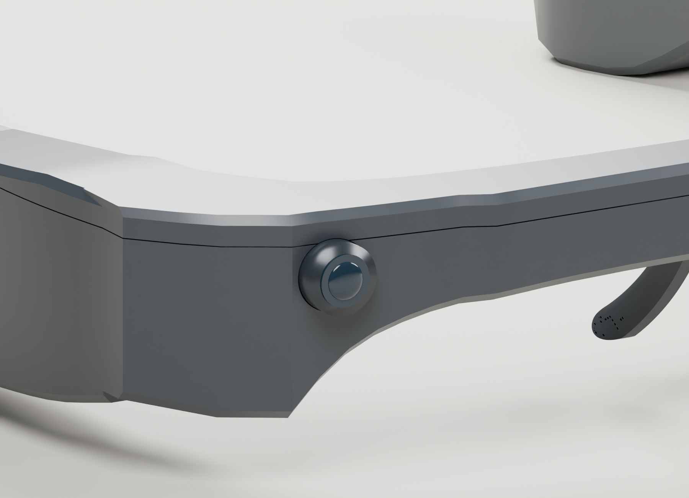
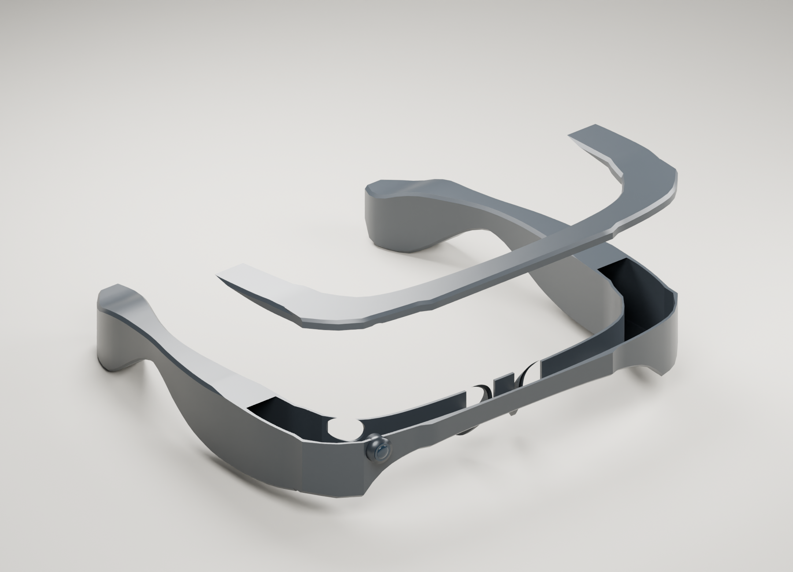
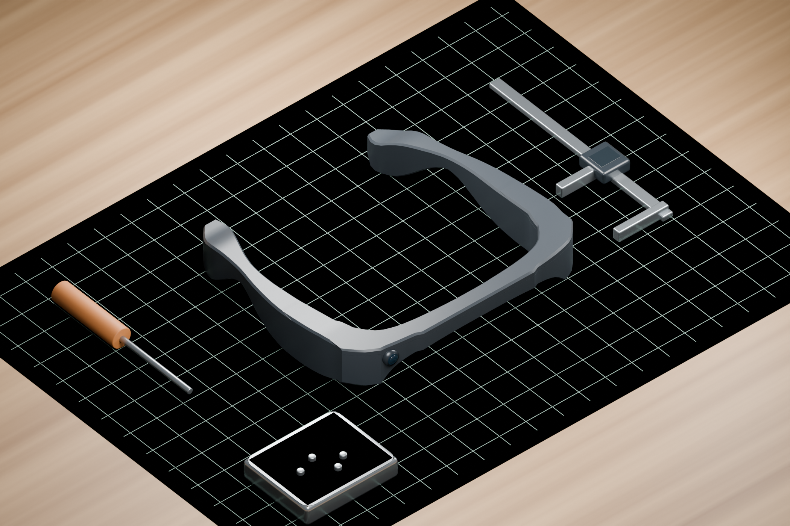

# Continuous Facets / v0.4 gallery

Eleven views rendered in Blender Cycles from the [included editable model](../design/v0.4/README.md). These are digital design visualizations, not photographs of a manufactured device. Scene props are generic staging, not project hardware requirements.

## 01 / Hero

## 02 / Front

## 03 / Side

## 04 / Top

## 05 / Rear

## 06 / Camera detail

The external optical part is a visualization; real optics alignment and mounting remain unverified.

## 07 / Open housing

The cover is raised for inspection. This view is not a validated assembly sequence; it deliberately does not invent battery, PCB or cable dimensions.

## 08 / Everyday desk

Synthetic scene with a generic notebook, phone and mug. It does not document device use.

## 09 / Maker workbench

Synthetic scene with generic tools. It is not a photograph of the community instruction described elsewhere.

## 10 / Photography workbench study

Perspective camera, revised lighting, material variation and more detailed generic tool props. Product geometry remains v0.4. This is CGI, not a photograph of a manufactured unit or a community workshop.

## 11 / Material and housing study

[Editable scene, render script and consistency record](../design/v0.4/presentation/展示入口.md).

## Image provenance

The approved concept drawing was AI-generated during design exploration. Every image above was subsequently rendered from the actual v0.4 mesh, with consistent geometry across angles. The scenes, [original nine-image manifest](../design/v0.4/render_manifest.json) and [two-image photography manifest](../design/v0.4/presentation/photography_manifest.json) are included so that others can inspect or reproduce them. No identifiable community participants or fabricated endorsements appear in this gallery.
