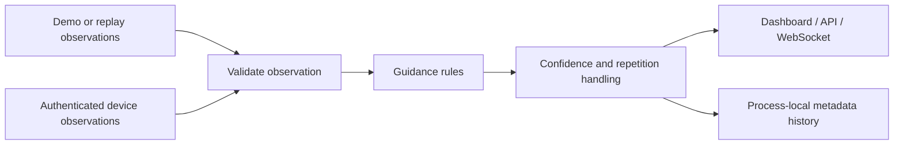

# Project overview

AI Glasses for Navigation combines a wearable hardware experiment, a software guidance prototype and community-oriented making. Its objective is to explore lower-cost visual assistance while making the design easier to understand and reproduce.

## Three connected strands

**Wearable design.** A camera-bearing, lensless wraparound frame provides a housing concept for electronics. The latest design is v0.4, Continuous Facets: a straighter brow, clipped corners and broad planar temple surfaces. The original source assembly remains available as a reference. The new shell is an editable Blender mesh and a geometric enclosure study; it has not passed physical assembly or mobility testing.

**Software.** The runnable repository implements a hardware-free FastAPI service. Structured observations are validated and passed through deterministic guidance rules for traffic lights, nearby obstacles and crosswalks. Low-confidence observations produce uncertainty messages; repeated prompts are throttled. The browser dashboard, API and replay command use the same guidance implementation. An optional authenticated, rate-limited device endpoint accepts observations in controlled development environments.

**Community work.** The creator reports contact with four communities and nearly 100 blind or visually impaired people, plus making instruction in three communities intended to support continuation without ongoing personal funding or material donations. See [scope and cost](COMMUNITY_AND_COST.md) for precise definitions.

## What runs today, and what remains integration work

| Layer | Available here | Boundary |
|---|---|---|
| Guidance rules | Red/green/unknown light, obstacle and crosswalk handling | Rule outputs do not establish perception accuracy or safe crossing |
| Demo | Browser dashboard, REST API, WebSocket and JSONL replay | Demo observations are structured inputs, not live camera inference |
| Device gateway | Token authentication and per-device rate limit | Does not by itself connect a camera, ESP32 or speech system |
| 3D design | v0.4 Blender assembly, shell exports, render cameras, rebuild script | Physical scale, exact electronic parts, fastening and print tolerances remain unverified |
| Earlier exploration | Prior documentation described YOLO/YOLO-E, ESP32, voice and IMU concepts | Those descriptions must not be read as fully integrated capabilities of this runnable release |

## Broader prototype direction

Earlier project materials describe four intended user workflows: following tactile paving with visual guidance, recognizing crosswalks and traffic lights, finding named objects, and asking questions through voice interaction. They reference ESP32 camera capture, YOLO segmentation, YOLO-E object search, MediaPipe hand cues, and cloud speech/multimodal services.

Those materials explain the broader motivation and integration direction. They do not establish that all four workflows are functional in this release. The runnable core here deliberately accepts structured observations so that guidance behavior can be inspected and replayed independently of cameras, model weights and cloud availability. A complete wearable would additionally need reliable capture, perception, audio, power and enclosure integration, followed by testing in appropriately controlled settings.

## Architecture

A future vision adapter translates frames into observations. A future audio adapter can speak resulting messages. Sensor processing and cloud integrations should remain separated from the decision rules, so that recorded scenarios can be replayed and inspected.

## Attribution and provenance

The earlier repository README credited [AI-FanGe / OpenAIglasses_for_Navigation](https://github.com/AI-FanGe/OpenAIglasses_for_Navigation) as the upstream code project. That attribution is retained; this repository should not imply that all historical vision or voice components were authored here. Existing license notices are unchanged.

The v0.4 shell was rebuilt for this project from the approved Continuous Facets concept, using the existing local assembly as a spatial reference. The approved concept board was AI-generated. Published product angles and staged environments are rendered from the editable v0.4 Blender geometry, not documentary photos of a manufactured device or community event.

## Responsible use

This remains an assistive-technology research prototype. It is not a certified navigation device and must not replace a white cane, guide dog, professional orientation-and-mobility support, personal judgment or traffic rules. No field-safety, clinical or mobility-performance claim is made by this release.

## Detailed presentation materials

[完整项目说明](../design/v0.4/presentation/项目完整说明.md) · [新增渲染与可编辑场景](../design/v0.4/presentation/展示入口.md) · [外部活动照片参考](../design/v0.4/presentation/照片参考与拍摄清单.md)
